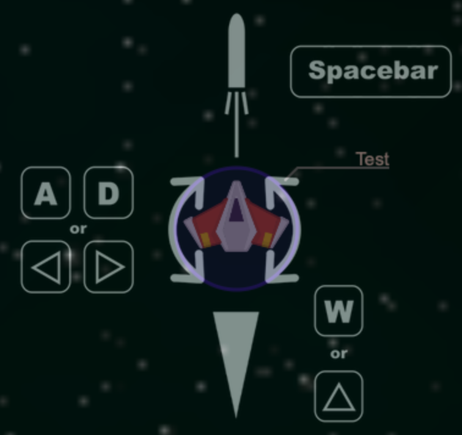

# SpaceDoom

This is a small and fun multiplier game I made for my matura thesis. You fly a spaceship in a asteroid field where you can encounter enemies. It's has two modes
* Global Mode: everyone is fighting everyone
* Team Mode: two teams are fighting each others

The controls are fairly easy:

You start with 100 health which can either be taken by bullets from enemies or from collisions. There are some health packs on the map to regenerate your health.

The difficulty of the game is to navigate through the asteroid and shoot the enemy while you can only use thrust in direction of where you are heading. 

Feel free to play it [here](http://spacedoom.herokuapp.com).

